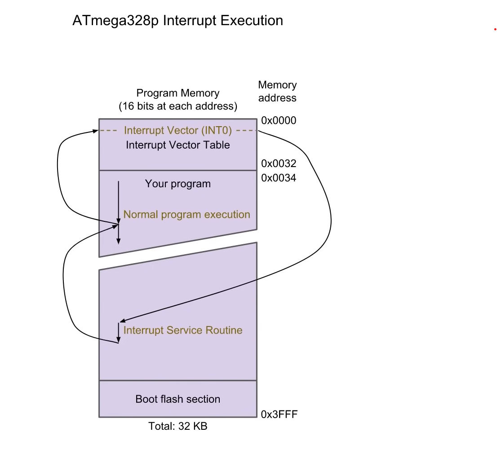
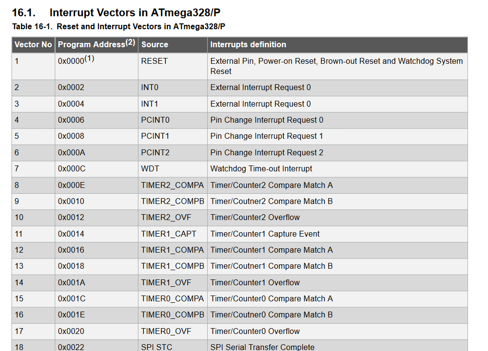
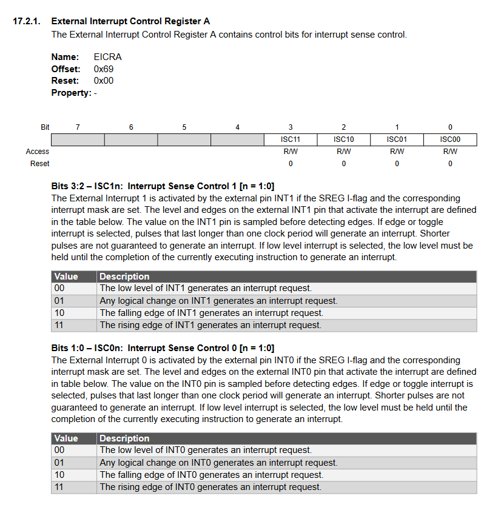
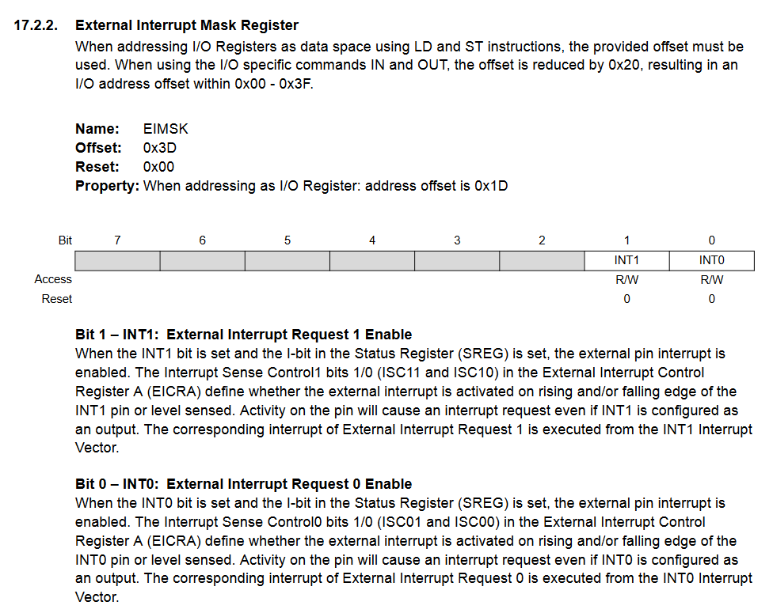
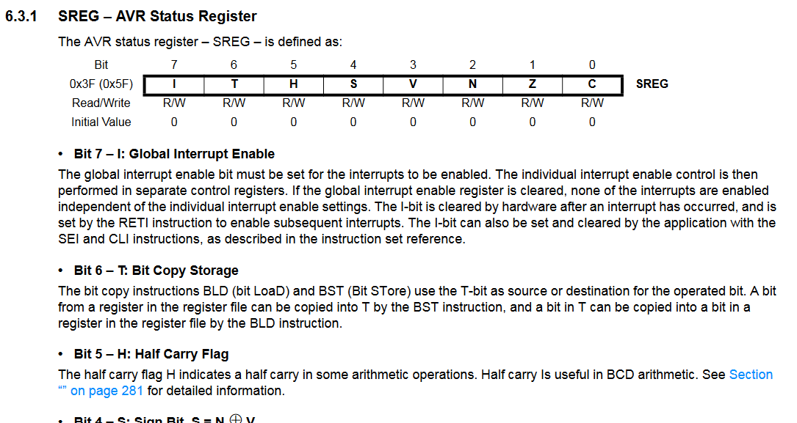

# Interrupts

### Two type of interrupts
1. External Interrupts
2. Internal Interrupts (Ex. Timmer interrupts)

>By generatting interupt Arduino stop the normal execution of code and save the work then directly jump to execute that ISR (Interrupts Service Routine)



> Arduino have already predefine function for generatting interrupt

`Syntax`
```c++
attachInterrupt(digitalPinToInterrupt(pin), ISR, mode);
```
`Parameters`

* interrupt: the number of the interrupt(int)
* pin: the pin number
* ISR: the ISR to call when the interrupt occurs; this function take no parameters and return nothing.
* mode: define when the interrupt should be triggered. Four constants are predefined as valid values:
  1. **_LOW_** to trigger the interrupt whenever the pin is low.
  2. **_CHANGE_** to trigger the interrupt whenever the pin changes the value
  3. **_RISING_** to trigger when the pin goes from high to low
  4. **_FALLING_** for when the pin goes from high to low.
  5. **_HIGH_** to trigger the interrupt whenever the pin is high


>To attact interrupt by arduino library

```c++
// pins
const uint8_t btn_pin = 2;
const uint8_t led_pin = 5;
// to save space we can use
//      int8_t
//      uint8_t
//      int16_t
//      uint16_t
//      int32_t
//      uint32_t
//      int64_t
//      uint64_t

// Globals
uint8_t led_state = LOW;

void setup() {
    pinMode(btn_pin, INPUT_PULLUP);
    pinMode(led_pin,OUTPUT);

    attachInterrupt(digitalPinToInterrupt(btn_pin), toggle, FALLING);
}

void loop() {
    
    // Normal flow of CPU
    delay(500);
}

void toggle() {
    led_state = !led_state;
    digitalWrite(led_pin,led_state);
}
```

>To set mannually interrupt by modifing register value

* To interrupt to trigger three condition must be met
  1. Global interrupts must be enabled (In arduino automatically enables global interrupts but if you're not working in Arduino you will have to perform this step menually.)
  2. The individual interrupts must be enabled (Usally done by setting bit in register)
  3. Interrupt condition met (Our case falling edge on pin - HIGH TO LOW)

* Interrupt Vectors in ATmega328
  
   

* When ever interrupt meet those condition then interrupt trigger and then exection goes to Interrupt Vector which is initilized on that pin (Here pin 2 is set as INT0 ) which have addedss 0x0002.
* Then in that address the ISR program address is stored then CPU jump somewhere in program memory where ISR is written.


### Lets set interrupt



1. We have to set ISC01 and ISC00 as 10 for The falling edge of INT0 generates an interrupt request.



2. To enable for INT0 (pin 2) we have to set INT0 bit in EIMSK (External Interrupt Mask Register) as 1



3. To enable global interrupt we have to set I bit of SREG as 1, we can directly enable it by calling sei() and desable it by calling cli() in code.

> Below code is manual setup of interrupt

```c++
// Pins
const uint8_t btn_pin = 2;
const uint8_t led_pin = 5;

void setup() {
    // Set button pin to be input with pullup
    DDRD &= ~(1 << btn_pin);
    PORTD |= (1 << btn_pin);

    // Set LED pin to be output
    DDRD |= (1 << led_pin);

    // Falling edge of INT0 generates interrupt
    EICRA |= (1 << ISC01);
    EICRA &= ~(1 << ISC00);  // Some thing define in arduno ide that why we can directly using name as ISCxx --> some number (bit position)

    // Enable interrupts for INT0
    EIMSK |= (1 << INT0);

    //Enable global interrupts
    sei(); // Function set I bit of SREG as 1
}

void loop() {
    // Processer doing some complex calculation
    delay(500);
}
ISR(INT0_vect) {
    PORTD ^= (1 << led_pin); // Bit wise exor for toggle the led pin with one line
}

```

>Remember : Always keep your Service Routine as short as possible (by default in AVR you can't interrupt a interrupt)

* If you find that your ISR takes too much of time then you can always handle interrupt as a flag. This is similar to pooling but has the benifit of not missing interrupt.

> Remember : If you using global variable in your main program and in interrupt then you should always declare as volatile keyword, this tell the compiler that the variable might change out side the main exicution thread which it does in ISR. 

```c++
// Pins
const uint8_t btn_pin = 2;
const uint8_t led_pin = 5;

// Globals
volatile uint8_t flag = 0;

void setup() {
    // Set button pin to be input with pullup
    DDRD &= ~(1 << btn_pin);
    PORTD |= (1 << btn_pin);

    // Set LED pin to be output
    DDRD |= (1 << led_pin);

    // Falling edge of INT0 generates interrupt
    EICRA |= (1 << ISC01);
    EICRA &= ~(1 << ISC00);  // Some thing define in arduno ide that why we can directly using name as ISCxx --> some number (bit position)

    // Enable interrupts for INT0
    EIMSK |= (1 << INT0);

    //Enable global interrupts
    sei(); // Function set I bit of SREG as 1
}

void loop() {
    if(flag) {
        PORTD ^= (1 << led_pin);
        flag = 0;
    }
    // Processer doing some complex calculation
    delay(500);
}
ISR(INT0_vect) {
    flag = 0;
}

```
> Note :- Many time compiler will be set optimize the variable like this - it sees that we set the flag to zero and assume that it will never change it again because compiler doesn't see in ISR. It assume that if statement is always false and remove that chunk of code to save memory. If we set flag variable as volatile we exeplicitly telling the compiler that compiler should not optimize out parts of code with that variable.


