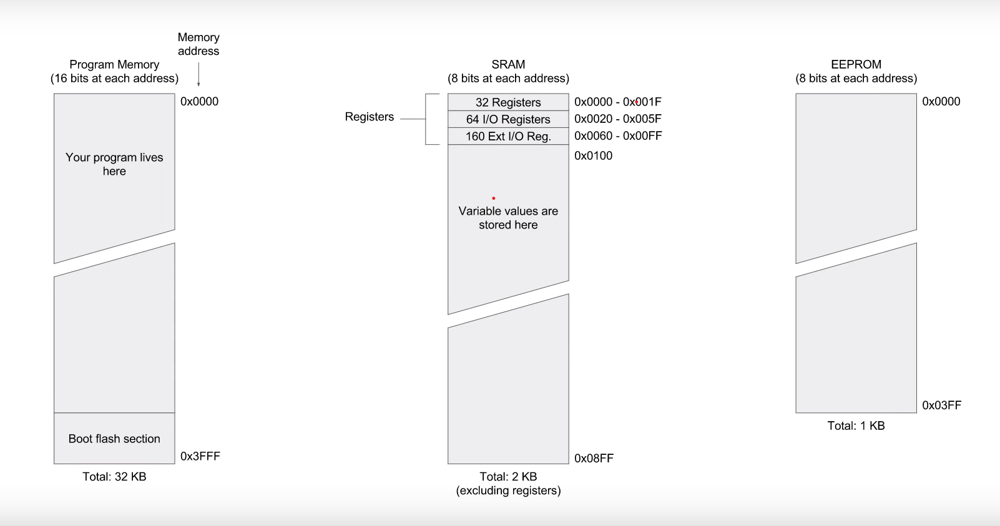
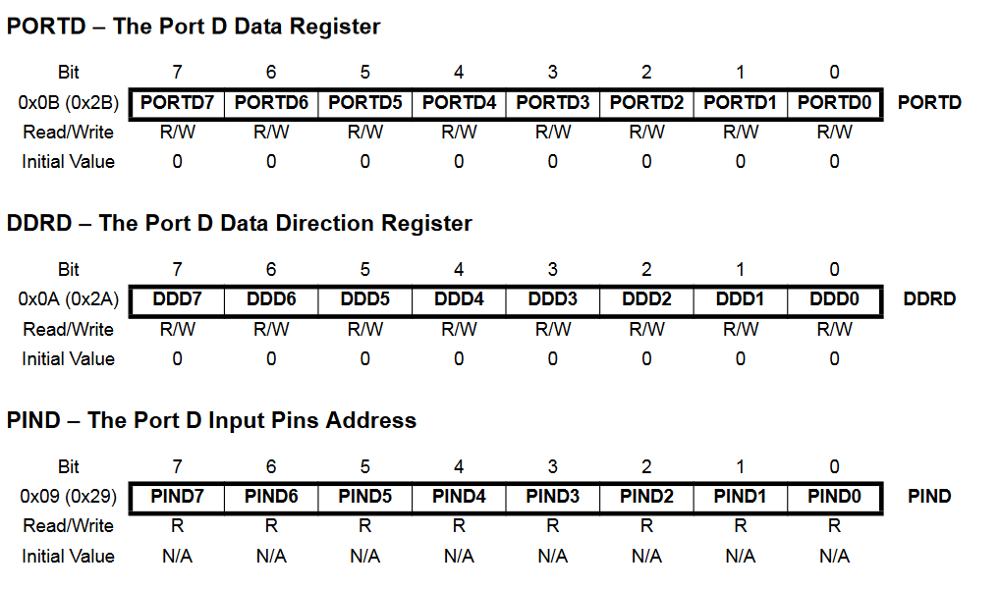

# Registers

```Atmega328p have three memory```
1. Program memory (16 bits at each address)
2. SRAM (8 bits at each address)
3. EEPROM (8 bits at each address)
   
    

### Program Memory

* Responsible for Program Store

### EEPROM

* Separate Bus
* Permanent Storage for store some setting information

### SRAM

* CPU direct access memory and load program to exicution
* General purpose register as well special purpose register live in 256 spaces in SRAM


> To user register to control arduino pin we have to know arduino each pin is separated with different port

1. Port B (Digital pin 0-7)
2. Port C (Digital pin 8-13)
3. Port D (Analog pin A0-A5)


> To control those pin each port have 3 special purpose register
1. PORT
2. DDR (Date Direction Register)
3. PIN
   
> Let I have to control PORT D

 

* To setting DDR register we can tell the microcontroller that pin is output or input (1 - OUTPUT / 0 - INPUT)
* To setting PORT register we can tell the microcontroller to change pin logic
  > If in DDR register is set pin as 1 (OUTPUT)
  1. PORT is 1 then pin is set to HIGH
  2. PORT is 0 then pin is set to LOW
   >If in DDR register is set pin as 0 (INPUT)
   1. PORT is 1 then internal pull-up register is on
   2. PORT is 0 then internal pull-pu register is off
* We can read only the PIN register to get input from pin (HIGH or LOW)


### Let I have to take input from pin 2 (button attacted) and output in pin 5 (LED attached)

```c++
const int btn_pin = 2;
const int led_pin = 5;

void setup() {
    pinMode(btn_pin,INPUT_PULLUP);
    pinMode(led_pin,OUTPUT);
}
void loop() {
    int btn = digitalWrite(btn_pin);

    if(btn == LOW) {
        digitalWrite(led_pin,HIGH);
    } else {
        digitalWrite(led_pin,LOW);
    }
}
```

### By using register with same functionality

```c++
const int btn_pin = 2;
const int led_pin = 5;
void setup() {
    DDRD = B00100000;  // Setting pin 5 as output and pin 2 as input
    PORTD = B00000100; //Setting pin 5 as logic low and pin 2 as pull-up
}
void loop() {
    int btn = (PIND & (1 << btn_pin)) >> btn_pin; //digital Read by using masking

    if(btn == LOW) {
        PORTD = (1 << led_pin) | PORTD; //digital Write HIGH
    } else {
        PORTD = ~(1 << led_pin) & PORTD; //digital Write LOW
    }
}
```

> To make this little bit easier arduino library have _BV macro which is defined for the AVR family of microcontrollers and out 328p also in it...
```c++
#define _BV(bit) (1 << (bit))
```
> BV macro just makes the 1 left shift by bit number operation a little easier to read and faster to execute

```c++
const int btn_pin = 2;
const int led_pin = 5;
void setup() {
    DDRD = B00100000;  // Setting pin 5 as output and pin 2 as input
    PORTD = B00000100; //Setting pin 5 as logic low and pin 2 as pull-up
}
void loop() {
    int btn = (PIND & _BV(btn_pin)) >> btn_pin; //digital Read by using masking

    if(btn == LOW) {
        PORTD = _BV(led_pin) | PORTD; //digital Write HIGH
    } else {
        PORTD = ~_BV(led_pin) & PORTD; //digital Write LOW
    }
}
```

## NOTE - Because reading all register to work with a prototype is painful that why arduino introduce the abstraction layer to hide those thing and see only relevent thing that need


