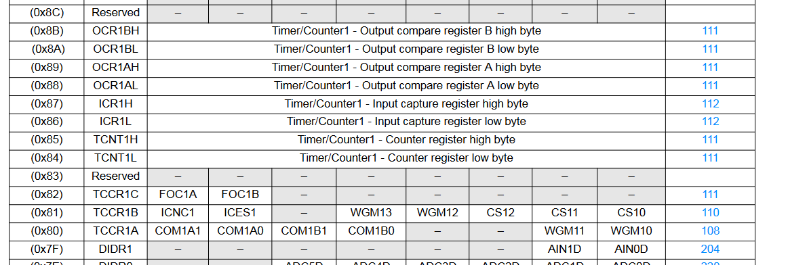
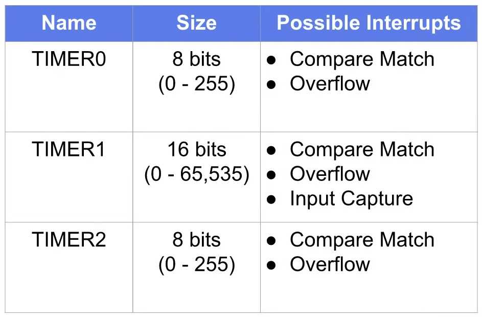

# Timer-Interrupts

If we look at different interrupt vector of Atmega328p, you see 3 timmer leveled

1. Timer 0
2. Timer 1
3. Timer 2
   

We can see each timer lives in memory called `Special Function Register` (You can find it from __Register Summary__ section in Datasheet)

* Timer0 --> TCNT0 (Timer Counter 0)
  

* Timer1 --> TCNT1 (Timer Counter 1)
   * It take 2 byte of memory
        1. TCNT1L
        2. TCNT2L
   

* Timer2 --> TCNT2 (Timer Counter 2)

> Lets see how __Timer__ are automatically incremented without any code

Each of these timer can be directly or indirectly connected to the system clock (16 MHz)

* System clock is a Squre wave that is produce internally in microcontrller based in your settings.
* It could be generated inside the microcontroller it self or from a connected oscillator or crystal.
* System clock to important to operation of almost everything in microcontroller.
* In Arduino Uno there is 16 MHz crystal connected to the microcontroller.
* The timer can be directly connected to system clock. (It means the timer interrupt increments once every 1/60 MHz = 62.5 nano seconds)
* The system clock is also fed into another piece of hardware known as a Prescaler. (The prescaler is devide the clock cycle with some number to reduce the clock speed by devide 2,4,8,16 .... we can configure it by __Clock Select__) Ex. We set the prescaler to 8 then timer is increments only once every eight system clock pulses.

`Timer 0 and timer 2 are both eight bits each which means they count from 0 to 255. Note that once a timer reaches its maximum value it starts over again from zero. Timer one however takes up two registers in memory so it's actually 16 bits meaning it can count from 0 to 65,535 before rolling over.`

`Each timer can generate one or more interrupts.`

1. Compare Match Interrupt
   `We can write a value in another register so that when one of the timer's equals that value it throws an interrupt. All timer in ATmega 328p can do it.`
2. Overflow Interrupt
   `In this case processor to generate an interrupt when each of the timer's overflows. Which means rolls over from its max value to zero.`
3. Input Capture
   `Timer 1 can be configured to store its current count to another register whenever an external event happens on a pin.`

> IF  YOU WORKING ON ARDUINO NOTE THAT SEVERAL FUNCTIONS ARE RELY ON TIMERS TO OPERATE.
   
> So you begin playing with TIMER 0 then DELAY(), MILLIS() AND MICROS() function will no longer work properly. Same apply for Servo and tone function for timers 1 and 2.

> The analog write function uses all three timers in the uno but which timer depends on which pin you're using, for ex. If you want to menually control timer 1 for other things you probably shouldn't use analog right on pins 9 and 10.

  

